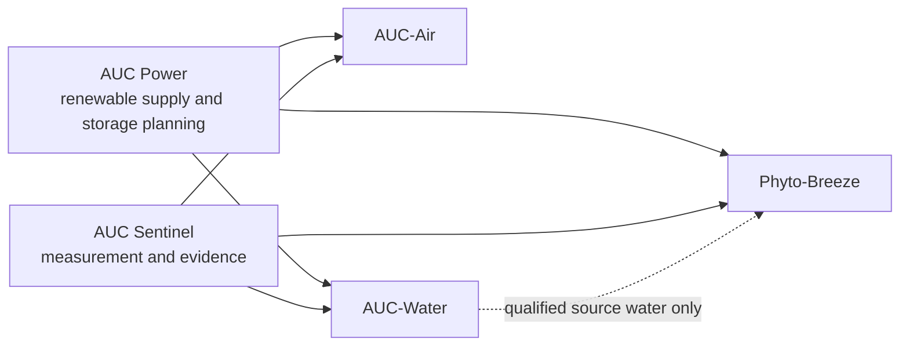

# AUC Portfolio Architecture

## Purpose

AUC is a coordinated set of environmental systems rather than a single combined machine. Each module owns its process hazards, measurements, and release criteria. A shared data plane provides a unified view without creating shared process paths.



The dashed water path is optional and exists only after treatment meets the selected PEM OEM's feed-water specification. It is not a shared process loop.

## AUC-Air

### Purpose

Treat defined particulate and gas-phase pollutants in a controlled single-pass airflow.

### Production architecture target

```text
weather louver → coarse cyclone → sealed dust drawer → equalization diffuser
→ PAN mechanical filter → TiO2/UVA reactor → MnO2 ozone-polishing cassette
→ downstream EC blower → monitored discharge
```

### Design rules

- The cyclone manages coarse dust, fibres, grit, and large agglomerates. It makes no PM2.5 or submicron-soot claim.
- The PAN stage owns the claimed 0.1–2.5 micrometre particle performance.
- The 365 nm TiO2/UVA reactor requires independent qualification; earlier 254 nm test results cannot support a 365 nm claim.
- Corona remains disabled unless a measured particle-performance benefit and ozone compliance both justify activation.
- Product performance is limited to named pollutants, operating conditions, and independently measured uncertainty.

### Scale rule

Maintain a nominal superficial velocity of 1.311 m/s through the microchannel array:

\[
A_{active}=\frac{Q}{1.311\ \mathrm{m/s}}
\]

| Nominal flow | Active frontal area | Example arrangement |
| ---: | ---: | --- |
| 250 CFM | 0.090 m² | 300 × 300 mm cassette |
| 1,000 CFM | 0.360 m² | 600 × 600 mm cassette |
| 5,000 CFM | 1.800 m² | Five 600 × 600 mm modules |

## Phyto-Breeze

### Purpose

Produce verified delivered oxygen product through PEM water electrolysis. It is not an air cleaner, carbon-removal device, or atmospheric oxygen-enrichment appliance.

### Product target

\[
m_{O_2,verified,L95}\ge25.0\ \mathrm{kg\ in\ 3\ h}
\]

This is an oxygen-mass-only tree-equivalent reference based on 45.36 kg O2 per mature tree per year. It does not imply carbon sequestration, habitat, cooling, or ecological equivalence.

### Independence rules

- No shared air ducts, blowers, UV/HV enclosures, gas headers, pressure-relief headers, access doors, or shutdown circuits with AUC-Air.
- Hydrogen and oxygen conditioning, venting, relief, drains, export, and service access remain physically separate.
- Hydrogen fuel-cell recycling is excluded because it consumes oxygen and does not create a net oxygen product.
- Atmospheric oxygen release is a separately engineered deployment mode, not the base product.

### Construction hold points

Construction depends on the selected PEM OEM's P&ID and interface-control document, site hazardous-area classification, HAZOP/LOPA, relief and dispersion engineering, final product/export design, and calibrated verification instrumentation.

## AUC-Water

Detailed AWG design basis: [AUC-Water AWG Concept](AUC_WATER_AWG_CONCEPT.md).

### Purpose

Build site water resilience by selecting the lowest-energy viable source and treating the water for its stated use.

### Source hierarchy

1. HVAC condensate recovery.
2. Rainwater capture and cistern storage.
3. Atmospheric water generation where local psychrometric data, renewable power, and water value justify it.
4. Potable-water treatment only as a separately permitted product.

### Initial product

The first AUC-Water release is non-potable: cooling-system makeup, irrigation, washdown, toilet flushing, or emergency reserve where local rules permit it.

### Operating metrics

\[
\text{yield}=\mathrm{L/day},\qquad
\text{specific\ energy}=\mathrm{kWh/L},\qquad
\text{autonomy}=\mathrm{days}
\]

Water-quality limits, treatment barriers, storage hygiene, cross-connection protection, and lab verification are defined by the intended use. AWG yield must be reported with its temperature, relative humidity, airflow, and measurement period. Mechanical intake filtration protects any AWG coil; electrostatic precharging is not part of the baseline. Captured rainwater and condensate must not be assumed potable or suitable for PEM feed water.

## AUC Sentinel

### Purpose

Provide the independent evidence layer for environmental performance and condition-based service.

### Minimum data domains

| Module | Required evidence |
| --- | --- |
| AUC-Air | airflow, stage differential pressure, PM, O3, temperature, RH, UV output, faults |
| Phyto-Breeze | delivered O2 mass/purity, product pressure and moisture, H2 crossover, water quality, stack state, safety status |
| AUC-Water | source availability, yield, storage level, conductivity, turbidity, treatment state, water-use boundary |

Use time-synchronised raw readings, calibration identifiers, alarm events, service actions, and immutable release-test exports.

## AUC Power

### Purpose

Coordinate site electrical capacity and renewable-energy use without making the systems operationally dependent on one another.

### Priority concept

1. Safety and essential monitoring.
2. AUC-Air airflow and verified treatment operation.
3. Water capture/treatment when a permitted storage demand exists.
4. Phyto-Breeze production only when the site electrical and hydrogen-management envelope is available.

Phyto-Breeze is a 60–75 kW industrial electrical load. It must not be represented as a small rooftop or window-solar accessory.
